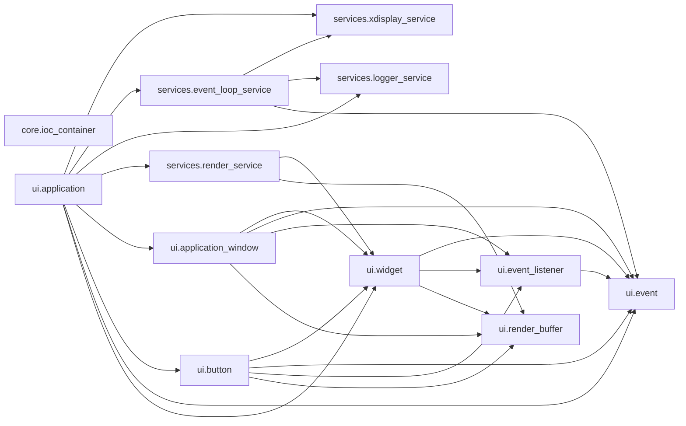

# Диаграмма модулей

```mermaid
flowchart LR
    core_ioc_container["core.ioc_container"]
    services_event_loop_service["services.event_loop_service"]
    services_logger_service["services.logger_service"]
    services_render_service["services.render_service"]
    services_xdisplay_service["services.xdisplay_service"]
    ui_application["ui.application"]
    ui_application_window["ui.application_window"]
    ui_button["ui.button"]
    ui_event["ui.event"]
    ui_event_listener["ui.event_listener"]
    ui_render_buffer["ui.render_buffer"]
    ui_widget["ui.widget"]
    services_event_loop_service --> services_xdisplay_service
    services_event_loop_service --> services_logger_service
    services_event_loop_service --> ui_event
    services_render_service --> ui_widget
    services_render_service --> ui_render_buffer
    ui_application --> services_xdisplay_service
    ui_application --> services_event_loop_service
    ui_application --> services_logger_service
    ui_application --> services_render_service
    ui_application --> ui_application_window
    ui_application --> ui_button
    ui_application --> ui_event
    ui_application --> ui_widget
    ui_application_window --> ui_widget
    ui_application_window --> ui_event
    ui_application_window --> ui_event_listener
    ui_application_window --> ui_render_buffer
    ui_button --> ui_widget
    ui_button --> ui_event
    ui_button --> ui_event_listener
    ui_button --> ui_render_buffer
    ui_event_listener --> ui_event
    ui_widget --> ui_event
    ui_widget --> ui_event_listener
    ui_widget --> ui_render_buffer
```
